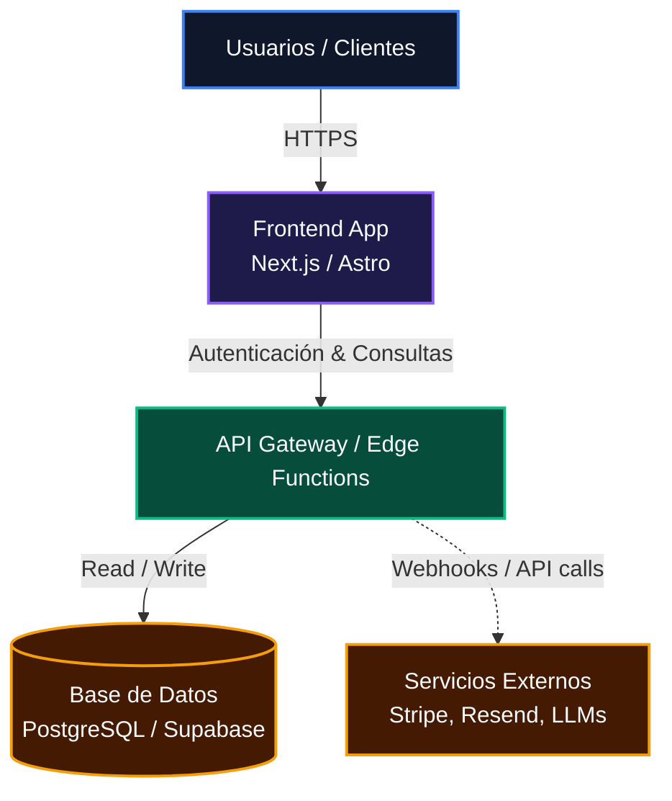
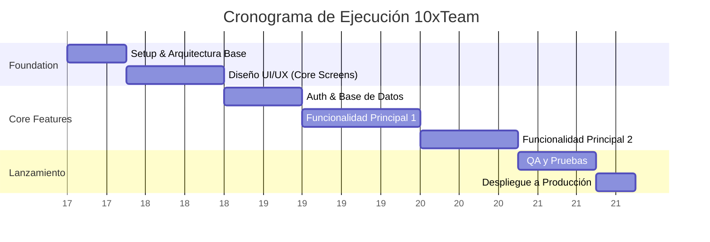

# 🚀 10xTeam: Análisis de Arquitectura y Roadmap MVP

> **Cliente:** [Nombre del Cliente / Proyecto]
> **Fecha:** [Fecha de Entrega]
> **Preparado por:** 10xTeam

---

## 1. Resumen Ejecutivo

### El Cuello de Botella Actual
[Breve descripción del problema del cliente. Ejemplo: "Actualmente operan con hojas de Excel desconectadas, lo que limita su capacidad de escalar a más de 50 envíos diarios por errores humanos."]

### La Solución 10x
[Cómo lo vamos a resolver de forma técnica y rápida. Ejemplo: "Un portal B2B centralizado donde los clientes autogestionen envíos, conectado directamente al ERP mediante una API REST."]

---

## 2. Diagrama de Arquitectura Inicial

Diseñamos una arquitectura moderna, sin servidor (serverless) y altamente escalable para minimizar costos fijos y soportar picos de tráfico.

*(Nota: Este diagrama representa la infraestructura inicial que desplegaremos para tu proyecto en las primeras 48 horas tras iniciar).*

---

## 3. Alcance del MVP (Producto Mínimo Viable)

Para garantizar un lanzamiento rápido en Semanas, nos enfocamos estrictamente en el núcleo de valor.

✅ **LO QUE INCLUYE EL MVP:**
- Autenticación de usuarios y gestión de perfiles.
- [Funcionalidad Core 1: ej. Dashboard de creación de pedidos].
- [Funcionalidad Core 2: ej. Integración de pagos con Stripe].
- Panel de administración básico para tu equipo interno.

❌ **LO QUE SE POSTERGA PARA LA FASE DE EVOLUCIÓN:**
- [Funcionalidad compleja 1: ej. App móvil nativa (iOS/Android)].
- [Funcionalidad compleja 2: ej. Reportes analíticos avanzados].

---

## 4. Roadmap de Ejecución (En Semanas, no Meses)

Nuestro cronograma está diseñado para entregas iterativas rápidas. Tendrás visibilidad del software desde la Semana 2.

---

## 5. El Stack Tecnológico 10x

Seleccionamos herramientas de grado empresarial que aceleran el desarrollo sin sacrificar escalabilidad a largo plazo.

- **Frontend:** Astro / Next.js *(Para máxima velocidad y SEO).*
- **Backend / Auth:** Supabase / Firebase *(Seguridad robusta y bases de datos en tiempo real).*
- **Estilos:** TailwindCSS / Vanilla CSS avanzado *(Diseño premium y componentes reutilizables).*
- **Infraestructura:** Vercel *(Despliegue continuo en la nube y CDN global).*

---

## 6. Recomendación de Inversión (El Plan 10x)

Basado en la auditoría de tu proyecto, nuestra recomendación técnica y comercial es tomar el siguiente camino para mitigar riesgos y maximizar tu retorno de inversión:

> **[SELECCIONAR SOLO UNA OPCIÓN AL ENTREGAR AL CLIENTE]**
> 
> **OPCIÓN A (Para Proyectos Rápidos): Plan MVP Precio Fijo**
> Tu proyecto tiene un alcance ideal para ser construido y lanzado en 4 a 5 semanas. 
> - **Inversión:** $1,249 USD (Pago único).
> - **Beneficio:** Obtienes el software rápido y sin sorpresas. Una vez lanzado, evaluamos si requieres nuestro plan mensual para agregar más funciones.
> 
> **OPCIÓN B (Para Proyectos Grandes): Plan Evolución Continua**
> Tu visión es amplia y construir un "MVP" tomaría varios meses. En 10xTeam no hacemos proyectos gigantes de precio fijo porque son riesgosos para ti. Te proponemos construirlo mes a mes de forma ágil.
> - **Inversión:** $799 USD / mes (Compromiso inicial sugerido de [3 o 6] meses basado en el alcance).
> - **Beneficio:** Tendrás una versión utilizable el primer mes. Si terminamos el núcleo antes del mes 6, usamos el tiempo restante para construir nuevas funciones avanzadas que sugiera tu mercado.

---

## 7. Siguientes Pasos

Si este mapa de ruta encaja con tu visión, estamos listos para transformar tu idea en código.

1. **Aprobación:** Confirma que el alcance del MVP y el stack son los correctos.
2. **Setup:** Realiza el pago inicial del plan seleccionado para bloquear al equipo de ingeniería.
3. **Arranque:** Te damos acceso a tu repositorio y entorno de pruebas en vivo en menos de 24 horas.

**[🚀 Iniciar el Proyecto Ahora](link-a-checkout-o-contacto)**
